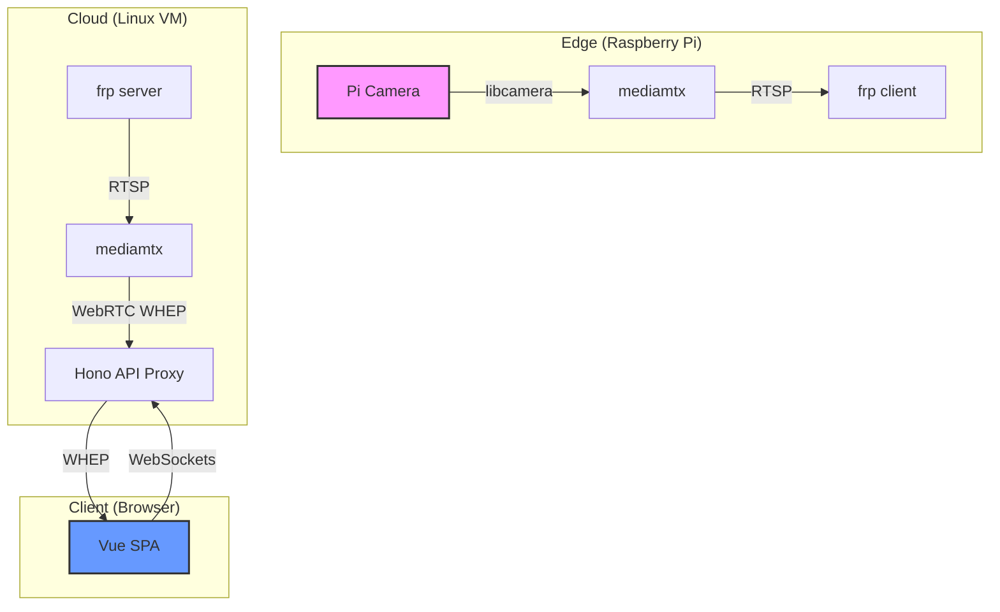

# ManlyCam 📸

[](https://github.com/zikeji/ManlyCam/actions/workflows/server-ci.yml)
[](LICENSE)
[](https://www.typescriptlang.org/)
[](https://nodejs.org/)
[](https://vuejs.org/)
[](https://www.raspberrypi.com/)
[](#-testing--coverage)

ManlyCam is a real-time Raspberry Pi camera streaming and chat platform, named after my dog, Manly. It provides low-latency WebRTC video streaming from a Pi at home to a web interface anywhere in the world, with integrated real-time chat and administrative controls (this was in the MVP, I'll add more and forget to update here).

## ✨ Inspiration

ManlyCam was not designed — it emerged. The idea was born during a remote meeting when a second device was repurposed as a dedicated camera for Manly (a deaf senior dog). The immediate, joyful reaction from coworkers validated the concept, and it has since become a part of every meeting.

ManlyCam formalizes this social ritual, making the experience frictionless and repeatable for coworkers to "drop in" and share a moment of levity with a familiar face. The physical enclosure is a nod to construction cameras, turning a DIY project into a piece of maker craft.

Beyond the social aspect, the project was also inspired by a goal to explore [BMAD](https://github.com/bmad-code-org/BMAD-METHOD) on a greenfield project, providing a hands-on way for the team to familiarize themselves with AI-driven workflows.


## 🏗️ Architecture

The system uses a mediamtx-based pipeline to deliver ultra-low latency video through firewalls and NAT.



1.  **Pi Camera**: Captures H.264 video.
2.  **mediamtx (Pi)**: Serves the stream via RTSP locally.
3.  **frp (Fast Reverse Proxy)**: Tunnels the RTSP stream from the local Pi to a public cloud server.
4.  **mediamtx (Server)**: Receives the RTSP stream and transcodes/repackages it for WebRTC (WHEP).
5.  **Hono API**: Acts as an authentication proxy for the WHEP endpoint and manages WebSockets for chat.
6.  **Vue SPA**: The user interface for viewing the stream and chatting.

## 📦 Monorepo Structure

- **apps/server**: Hono API, WebSocket hub, and stream relay.
- **apps/web**: Vue 3 + Vite SPA for viewing the stream and chatting.
- [**pi**](pi/README.md): Installation scripts and operator documentation for the Raspberry Pi agent.
- **packages/types**: Shared TypeScript definitions.

Detailed deployment and configuration instructions can be found in [**docs/deploy/README.md**](docs/deploy/README.md).


## 🚀 Requirements

- **Node.js**: v22.x or higher
- **pnpm**: v9.x or higher
- **Docker**: For running the server and mediamtx
- **Hardware**: Anything compatible with MediaMTX, but usage case here is a Raspberry Pi Zero 2 W

## 🛠️ Development

```bash
# Install dependencies
pnpm install

# Generate Prisma client
pnpm --filter @manlycam/server exec prisma generate

# Start development servers
pnpm dev
```

## 🧪 Testing & Coverage

We maintain high test coverage across both frontend and backend.

```bash
# Run all tests
pnpm test
```
