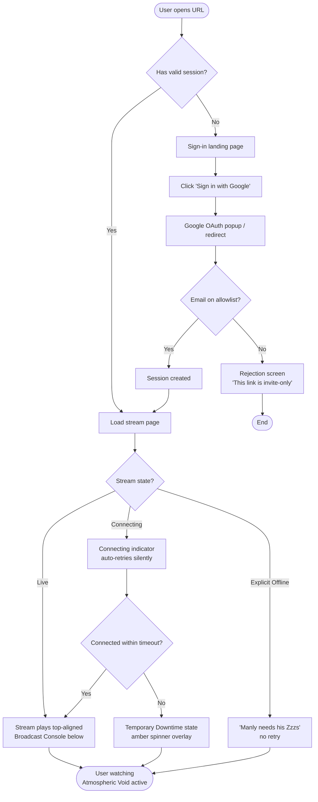
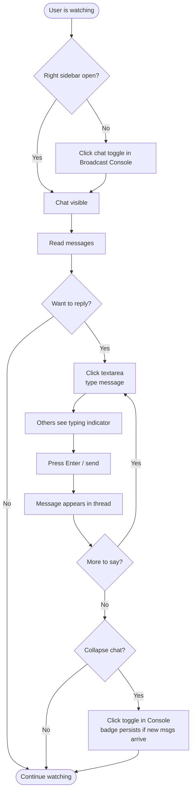
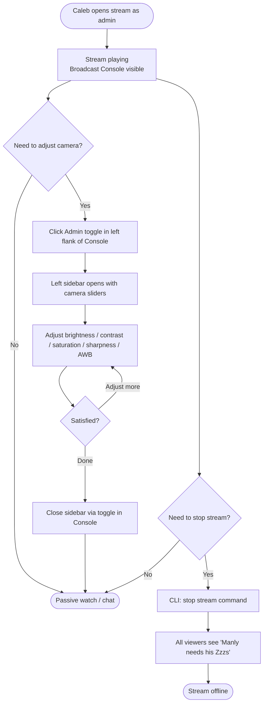
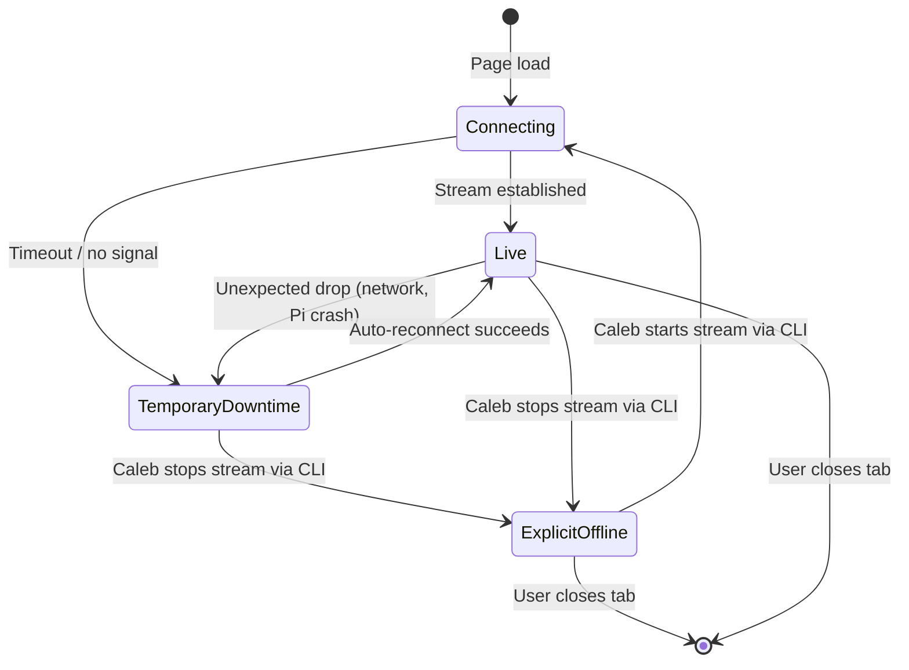

# UX Design Specification ManlyCam

**Author:** Caleb
**Date:** 2026-03-04

---

<!-- UX design content will be appended sequentially through collaborative workflow steps -->

## Executive Summary

### Project Vision

ManlyCam is a DIY novelty dog camera built on a Raspberry Pi Zero W 2 + Arducam, housed in a custom enclosure modeled after a company product. It delivers a low-latency, browser-based live stream of a dog to coworkers, gated by Google OAuth with a domain/email allowlist. A collapsible chat sidebar enables real-time social engagement alongside the stream. The product is greenfield, maker-driven, and built to delight — born from an accidental meeting moment that coworkers instantly loved.

### Target Users

| User | Context | Primary Need |
|---|---|---|
| **Viewer ("The Coworker")** | Desktop-first, tech-savvy, discovers via Slack link | Open URL → one-click sign-in → stream immediately visible. No setup, no friction. |
| **Owner/Admin (Caleb)** | Builder + primary admin, desktop + mobile | Reliable uptime, CLI admin tools, easy mobile check-in |
| **Privileged User (e.g. sister)** | Trusted moderator, web-only access | Moderate access and camera settings via UI with elevated permissions |
| **Occasional Guest** | External friend/contact, individually allowlisted | Same experience as standard viewer once admitted |

### Key Design Challenges

1. **Stream-first, zero-friction entry** — The entire first impression is the stream loading immediately after OAuth. Any loading state, error, or delay before the dog appears is a UX failure.
2. **Sidebar duality** — Two sidebars (left: camera controls for privileged only; right: chat for all) must coexist gracefully on desktop without cluttering the stream, and collapse cleanly on mobile.
3. **Role-conditioned UI** — The same URL serves viewers, privileged users, and owners with different visible affordances. Role surfacing needs to be seamless — privileged users should discover their powers naturally without a jarring admin-mode switch.

### Design Opportunities

1. **Personality-first design** — The product is inherently delightful and playful. The UI can lean into this with a dog-themed aesthetic that makes the experience feel special vs. generic streaming.
2. **Social moment amplification** — The chat sidebar is a first-class feature; great UX here (smooth collapse animation, read state, emoji-first) could make the social aspect genuinely fun rather than utilitarian.
3. **Instant confidence on load** — A well-designed loading/connecting state (connection status indicator, "Manly is live" vs. "stream offline" states) builds trust without requiring users to troubleshoot.

## Core User Experience

### Defining Experience

ManlyCam's core experience is singular: arrive, sign in once, see the dog. Every other feature
orbits this moment. The product succeeds when an authorized viewer opens the URL and the stream
is live before they have time to wonder if it's working. All UI decisions must protect this
primary experience — sidebars collapse, controls stay out of the way, and the dog fills the frame.

### Platform Strategy

Web-first, browser-based. No native app. Desktop is the primary context (knowledge workers
during work hours using a shared Slack link or bookmark); mobile is a real secondary use case
(Caleb checking in remotely; coworkers on phones). All UI must be fully functional on both.
Interaction model is mouse/keyboard primary with full touch support. No offline functionality
required — stream access requires network by nature.

### Effortless Interactions

- **OAuth sign-in**: One click. No forms, no passwords, no post-login setup. The allowlist check
  is invisible — authorized users flow straight through; unauthorized users are redirected immediately.
- **Stream auto-connect**: No play button. Stream begins as soon as the page loads. Connection
  state is indicated passively (e.g. "Manly is live" / "Stream offline"), never requiring user action.
- **Chat sidebar**: Opens and closes without disrupting the stream layout or triggering a page
  reflow. Fully functional on first open — no loading state for messages.
- **Camera controls (privileged)**: Changes apply in real time to the stream. No save/confirm
  step. Sliders and toggles respond immediately with visible stream feedback.

### Critical Success Moments

1. **Instant stream on load** — The stream is playing before the user consciously registers
   that the page has finished loading. This is the primary make-or-break moment.
2. **First chat message** — The first time a viewer types in the sidebar, the social energy of
   the product becomes real. A fast, responsive chat creates the "this is actually fun" moment.
3. **Seamless first-time sign-in** — A new authorized viewer clicks the link, signs in with
   Google in one click, and reaches the stream without any confusion or extra steps. This
   defines whether ManlyCam feels polished or DIY.
4. **Privileged user capability discovery** — A privileged user notices the camera controls
   sidebar naturally (left side), adjusts brightness, and sees it update live in the stream.
   The power feels earned, not buried.

### Experience Principles

1. **Stream is sacred** — The video feed is the product. Every layout, animation, and
   interaction decision must protect the stream's visual area and uninterrupted playback.
2. **Zero-friction entry** — No authorized user should ever need to read instructions. The
   sign-in and onboarding flow should be self-evident and complete in under 60 seconds.
3. **Role-aware, not role-driven** — The same URL serves all user types. Elevated capabilities
   appear naturally for those who have them; the base experience is identical for everyone else.
4. **Personality over polish** — This is a delightful maker project, not a SaaS product. The
   visual design should feel warm, playful, and intentional — dog-forward, not dashboard-forward.

## Desired Emotional Response

### Primary Emotional Goals

ManlyCam should make people feel joy. Not productivity, not efficiency — joy. The primary
emotional target is the moment of delight when the stream loads and the dog is simply there.
Secondary to that is warmth (this was made by a person, for people they like) and belonging
(the chat makes it a shared moment, not a solo experience).

### Emotional Journey Mapping

| Stage | Desired Feeling | What creates it |
|---|---|---|
| Discovery (Slack link) | Curiosity + intrigue | The product name and enthusiastic sharing context |
| Sign-in | Confidence, trust | Google OAuth — familiar, instant, no new account |
| First stream load | Delight, joy | The dog is there. Immediately. No waiting. |
| Chat interaction | Playfulness, connection | Real names, Google avatars, emoji, markdown |
| Return visit | Comfort, fondness | A genuine feel-good ritual bookmark |
| Stream offline | Mild disappointment (acceptable) | Clear "offline" state — no confusion, just "not today" |

### Micro-Emotions

| We cultivate | We avoid |
|---|---|
| Confidence — sign-in is safe and familiar | Skepticism — is this legit? |
| Delight — the stream surprises with its quality | Disappointment — buffering, low quality |
| Belonging — the chat is alive with real people | Isolation — watching alone in silence |
| Playfulness — this is fun, not serious | Corporate sterility |
| Trust — the UI communicates honesty | Anxiety — what is this doing with my Google account? |

### Design Implications

- **Delight** → personality-forward visual design; dog-themed iconography in empty/offline states;
  warmth in color palette
- **Warmth** → avoid cold SaaS aesthetics; dark mode should feel cozy, not industrial
- **Belonging** → chat sidebar shows Google avatars prominently; viewer presence indicator
- **Trust** → clear "Sign in with Google" CTA; explicit identity confirmation post-auth
  ("Signed in as Caleb"); no ambiguous data collection messaging
- **Playfulness** → product copy and status messages use personality
  (e.g. "Manly is live 🐕" not "Stream active")

### Emotional Design Principles

1. **Joy is the product** — If a design decision doesn't serve joy, warmth, or belonging,
   it needs a strong justification to exist.
2. **Honesty builds trust** — Every auth step, status indicator, and error state should
   communicate exactly what's happening in plain, friendly language.
3. **Presence creates belonging** — Visible identity (avatars, names) in the chat sidebar
   transforms passive viewing into a shared social moment.
4. **Personality in the margins** — Micro-copy, empty states, and status messages are
   opportunities to reinforce the product's warmth. Never leave them as defaults.

## UX Pattern Analysis & Inspiration

### Inspiring Products Analysis

**Twitch — Sidebar/Stream Layout Model**
The defining pattern is the sidebar as a *resizable peer* of the stream, not an overlay.
The stream always fills remaining horizontal space at correct aspect ratio when sidebars are
resized or collapsed. This directly maps to ManlyCam's dual-sidebar layout: a collapsible
camera controls panel (left, privileged only) and a collapsible chat panel (right, all users),
with the stream reflowing responsively between them. Draggable gutters at each sidebar edge
give users direct control over screen real estate allocation. *(Drag-resize is post-MVP; MVP
sidebars are fixed-width and collapse-only — see Story PM-2.)*

**Discord (dark mode + chat interactions) + Slack (chat style)**
Discord's dark theme palette (`#313338` surface, `#1E1F22` sidebar) is the reference point
for readable, non-fatiguing dark UI. The interaction model targets Slack: flat, linear message
list, no threading, no server/channel navigation. Identity is display-only — Google OAuth
avatar and display name rendered inline with each message. No clickable user profiles.
Discord's **typing indicator** (`X is typing...` with animated dots) is a high-value
micro-interaction to adopt: at ManlyCam's intimate audience scale (10–20 people), seeing a
specific coworker typing creates genuine social anticipation and makes the chat feel alive.

**Twitch "Viewers in Channel" / Discord Member List — Presence Awareness**
A viewer presence list (collapsible, within or alongside the chat sidebar) showing all
currently connected users by Google avatar and display name. This creates shared-experience
awareness — viewers can see who else is watching Manly alongside them — without requiring
any interaction or social graph. Presence is live-updated as users connect/disconnect.

**ShadCN UI — Component Foundation**
ShadCN UI (Radix UI + Tailwind + CSS variables) is the design system foundation. Its defaults
are well-considered: accessible components, first-class dark mode via CSS variable theming,
and high-quality primitives (Slider, Sheet, Popover, Avatar) that directly map to ManlyCam's
UI needs (camera controls, sidebar panels, emoji picker, user avatars).

### Transferable UX Patterns

**Layout Patterns:**
- **Resizable sidebar peers** (Twitch) — Sidebar panels resize by dragging a gutter; the
  stream fills remaining space fluidly. Both sidebars can be open simultaneously on wide
  viewports; each collapses independently on narrower screens.
- **Flat message list** (Slack) — Linear, chronological message display with generous
  spacing, avatar + name on first message in a group, compact continuation messages.

**Interaction Patterns:**
- **Typing indicator** (Discord) — Animated `X is typing...` indicator shown in the chat
  sidebar when one or more viewers are composing a message. Critical social signal for an
  intimate audience.
- **Viewer presence list** (Twitch/Discord) — Live-updated list of connected viewers,
  contextual to the current session, no persistent social graph.
- **Inline identity display** (Slack) — Google avatar (circular, ~32px) + display name
  rendered with each chat message. No click target — display only.
- **Real-time camera controls** — Slider/toggle components apply immediately with no
  save step; analogous to Discord's instant-apply settings toggles.

**Visual Patterns:**
- **ShadCN dark theme** — CSS variable-based theming for consistent dark mode, with
  Tailwind utility classes for layout. Warm neutral palette over cold grays.
- **Subtle status indicators** — Twitch-style dot indicators for stream live/offline state;
  small, contextual, non-intrusive.

### Anti-Patterns to Avoid

- **Sidebar-as-overlay** — Sidebars that float over the stream break the "stream is sacred"
  principle and obscure the content users came to see.
- **Clickable user profiles** — ManlyCam has no social graph. Profile click-throughs would
  create a dead-end interaction and false expectations.
- **Forcing a color mode** — Never hard-code light or dark; always respect
  `prefers-color-scheme`. Dark mode is the *default* when no preference is expressed,
  not the *only* mode.
- **Dense chat scroll** (Twitch-style ticker) — Appropriate for thousands of viewers, wrong
  for an intimate 10–20 person audience. Slack's spacious message style fits better.
- **Forced interaction for presence** — The viewer list should be passive. Seeing who's
  watching should require zero action; it's ambient, not a feature to discover.

### Design Inspiration Strategy

**Adopt directly:**
- ShadCN UI as the component and theming foundation
- Twitch's sidebar-peer layout model for stream + sidebars (collapse-only at MVP; drag-resize is post-MVP, see Story PM-2)
- Slack's message list style (spacious, avatar-grouped, flat)
- Discord's dark mode palette as the base color reference
- Discord's typing indicator micro-interaction

**Adapt for ManlyCam:**
- Twitch viewer list → simplified presence panel (avatars + names only, no stats/badges)
- Discord dark theme → warmed slightly toward cozy over industrial; dog-personality accents
- Dark mode strategy: follow `prefers-color-scheme`; default to dark when no preference
  declared; manual toggle available to override

**Avoid:**
- Any pattern that places UI over the stream
- Social mechanics (profiles, follows, reactions) beyond what's in MVP scope
- Hard-coded color mode assumptions in any component

## Design System Foundation

### Design System Choice

**ShadCN UI** (Radix UI primitives + Tailwind CSS + CSS variable theming)

ShadCN UI is the component and design system foundation for ManlyCam. Components are
scaffolded directly into the codebase via the ShadCN CLI — owned in-repo, no library
version dependency to manage. Radix UI provides the underlying accessible primitives;
Tailwind handles layout, spacing, and responsiveness; CSS variables drive the theme system
for first-class dark/light mode support.

### Rationale for Selection

- **Direct component fit**: Slider, Sheet, Avatar, Popover, and Separator primitives map
  directly to ManlyCam's UI needs (camera controls, sidebars, user identity, emoji picker)
- **Dark mode first-class**: CSS variable theming makes dark/light switching trivial and
  consistent across all components
- **Solo-builder workflow**: Copy-paste-into-repo model means full ownership with no
  upstream breaking change risk
- **Accessible by default**: Radix UI handles ARIA roles, focus management, and keyboard
  navigation for all interactive components
- **Caleb's explicit preference**: ShadCN UI was identified as a resonant design reference
  with "defaults that are just good"

### Implementation Approach

- ShadCN CLI to scaffold components on demand into the project component library
- Sidebar resize-by-drag is **post-MVP** — MVP sidebars are fixed-width and collapse-only (see Implementation Readiness Report 2026-03-06, UX-5)
- Tailwind CSS for all layout, spacing, and responsive breakpoint logic
- CSS custom properties at `:root` / `.dark` for color theme switching

### Customization Strategy

- Override ShadCN's default neutral palette with a warmer dark base
  (reference: Discord `#313338` surface, `#1E1F22` sidebar — warmed toward cozy)
- Dog-personality accents applied to semantic color tokens (primary/accent),
  not scattered inline — theming stays maintainable
- All custom components built to the same CSS variable contract as ShadCN components
  for consistent dark/light behavior
- Light mode supported via `prefers-color-scheme` detection; dark mode is the default
  when no system preference is declared; manual toggle persists user override

## Core User Experience (Detailed)

### Defining Experience

> **"Click the link → one tap → Manly is live."**

ManlyCam's defining interaction is arrival, not action. The product succeeds when a viewer
clicks a shared link and sees the dog before they've consciously registered that the page
finished loading. The sign-in step is a trust checkpoint, not a barrier — one click on a
familiar Google button, then immediately: the stream. This experience should feel less like
using an app and more like opening a window.

### User Mental Model

Viewers arrive with a link-sharing mental model: link → maybe a login → content. They've
done this with Google Docs, Loom, YouTube. Google OAuth (the same account they use for work)
is invisible friction. The stream auto-playing on arrival is the payoff. Any deviation from
this model — extra steps, unfamiliar UI, loading ambiguity — breaks the magic.

Return visitors expect to land directly on the stream without re-authenticating. Session
persistence is not optional; it's part of the mental model.

### Success Criteria

- Stream is visible and playing within ~2 seconds of the page loading post-auth
- No user action required to start the stream — auto-connects and auto-plays
- Connection state is honest and readable at a glance at all times (live / connecting / offline)
- First-time users complete the full flow (link → OAuth → stream) without confusion or
  need for any instructions
- Return visitors land directly on the stream, no re-auth required within a session

### Novel vs. Established Patterns

ManlyCam uses entirely **established patterns** — intentionally. OAuth sign-in via Google,
auto-playing video, and chat sidebars are interactions every user already understands. The
innovation is the *product itself* (a dog camera, made with love, with a custom enclosure),
not the interaction model. The UX should be invisible — familiar enough that users never
think about it, leaving all attention for the dog.

### Experience Mechanics

| Stage | Detail |
|---|---|
| **Entry — authenticated** | User arrives at URL with valid session → stream view loads immediately, stream auto-connects |
| **Entry — unauthenticated** | Landing page shown with single "Sign in with Google" CTA — no other UI, no distractions |
| **Auth flow** | Google OAuth redirect. Server-side allowlist check on return. Authorized → stream view. Unauthorized → friendly rejection page ("You don't have access to ManlyCam yet.") |
| **Stream connecting** | Subtle status indicator: "Connecting to Manly..." with a calm animation. No aggressive spinners. |
| **Stream live** | Status switches to live indicator (green dot + "Manly is live 🐕"). Stream plays immediately — no play button. |
| **Stream explicitly offline** | Caleb has stopped the stream via CLI. Status: "Manly is offline for now." — calm, intentional tone. No retry behavior. No broken video element. |
| **Stream temporarily down** | Unexpected interruption (network drop, Pi crash, etc.). Status: "Trying to reconnect..." — auto-retry with backoff, honest progress indication. Resolves automatically when stream recovers. No panic, no error codes. |
| **Session end** | User closes the tab. No "are you sure?" prompts. No session cleanup UX required. |

## Visual Design Foundation

### Color System

ManlyCam's color palette is derived from Manly's physical identity: dark brown coat,
grey and white streaks, and the signature tooth. The result is a warm dark palette that
feels cozy and alive — distinct from the cold industrial greys of generic dark UIs.

**Dark Mode (Primary) — CSS Custom Properties:**

| Token | Value | Rationale |
|---|---|---|
| `--background` | `hsl(20, 8%, 10%)` | Warmed dark base — not pure black, not cool grey |
| `--surface` | `hsl(20, 6%, 14%)` | Manly's coat in shadow — primary card/panel surface |
| `--sidebar` | `hsl(20, 5%, 11%)` | Slightly deeper surface for sidebar panel contrast |
| `--primary` | `hsl(25, 50%, 38%)` | Warm brown accent — his coat in ambient light |
| `--primary-hover` | `hsl(25, 50%, 46%)` | Interactive lift on primary elements |
| `--muted` | `hsl(30, 5%, 55%)` | Grey streak — secondary/muted text and icons |
| `--foreground` | `hsl(30, 15%, 92%)` | Near-white with warmth — his white streaks |
| `--border` | `hsl(25, 5%, 20%)` | Warm subtle dividers |

**Semantic / State Colors:**

| Token | Value | Usage |
|---|---|---|
| `--live` | `hsl(142, 70%, 45%)` | "Manly is live 🐕" indicator — accessible green |
| `--reconnecting` | `hsl(38, 95%, 55%)` | "Trying to reconnect..." — amber, not alarming |
| `--offline-explicit` | `hsl(30, 5%, 42%)` | Intentional offline — muted, calm, no urgency |

**Color Mode Strategy:**
- Dark mode is the default when `prefers-color-scheme` returns no preference
- Light mode tokens defined for completeness; same palette lightened, warm neutrals maintained
- Manual toggle available; preference persisted in localStorage

**Easter Eggs & Brand Nods:**
- Favicon: Manly's signature tooth (custom SVG — a small gleaming off-white shape). Used once, not repeated in UI.
- Footer: configurable copyright/brand line driven by deploy-time config (`CUSTOM_FOOTER`) — no hardcoded company name in codebase.

### Typography System

**Primary typeface:** Inter (ShadCN/system default)

Inter was chosen for readability, dark mode legibility, and neutral personality. The
product's character comes from its palette, micro-copy, and Manly himself — not from
an expressive typeface. Novelty fonts (paw bullets, etc.) are explicitly out of scope.

**Type scale (Tailwind/ShadCN defaults):**

| Role | Size | Weight | Usage |
|---|---|---|---|
| Stream status | `text-sm` | `500` | Live/offline/reconnecting indicator |
| Chat message body | `text-sm` | `400` | Message content |
| Chat display name | `text-sm` | `600` | Username above message group |
| Sidebar section label | `text-xs` | `500` | "Viewers", "Camera Controls" headings |
| Landing CTA | `text-lg` | `600` | "Sign in with Google" button |
| Page title (tab) | — | — | "ManlyCam 🐾" |

### Spacing & Layout Foundation

**Base unit:** 8px (Tailwind default scale)

**Layout model:** Three-column fluid layout
- `[Left sidebar — collapsible, privileged only]` + `[Stream — fills remaining space]` + `[Right sidebar — collapsible, all users]`
- Stream fills 100% of available horizontal space between open sidebars, maintaining 16:9 aspect ratio
- Sidebar default widths: left `280px`, right `320px` — fixed-width at MVP, collapsible only (drag-resize is post-MVP, see Story PM-2)
- On mobile: sidebars collapse to bottom sheet or off-canvas drawers; stream fills full viewport width

**Spacing principles:**
- Stream view: zero padding on the video element — edge to edge within its container
- Chat messages: `p-3` per message row; `gap-1` between continuation messages; `gap-3` between new speaker groups
- Sidebar panels: `p-4` interior padding; `gap-2` between controls
- Generous line height (`leading-relaxed`) for chat message readability

### Accessibility Considerations

- All color pairs validated to WCAG AA contrast minimum (4.5:1 for text, 3:1 for UI components)
- `--foreground` on `--surface`: ~8:1 contrast ratio — passes AAA
- `--live` green verified against `--surface` background for status indicator legibility
- All interactive components use Radix UI primitives — ARIA roles, focus management, and keyboard navigation included
- Font size minimum `text-sm` (14px) across all UI — no sub-12px text
- Color is never the sole conveyor of meaning (status indicators include text labels alongside color dots)

---

## Design Direction Decision

### Directions Explored

Seven design directions were produced as an interactive HTML showcase (`ux-design-directions.html`) covering:

- Desktop layout variants (three-column; icon rail; stream-forward collapsed defaults; bottom chat bar)
- Mobile layout variants (portrait bottom chat bar; bottom chat bar with overlay drawers)
- Three app states: Sign-in landing, Explicit Offline, Temporary Downtime / Reconnecting

### Chosen Direction

**Desktop — Top-Aligned Stream with Broadcast Console & Atmospheric Void**

| Element | Behaviour |
|---|---|
| Layout | Top-aligned stream + Broadcast Console below + Atmospheric Void filling remaining height. Right sidebar (chat) runs full height alongside. |
| Topbar | None — stream is anchored near the top (e.g., `5vh` padding to let it breathe). |
| Broadcast Console | Sleek, semi-transparent horizontal strip directly below the video. Left: Admin toggles (Camera Controls). Center: Live indicator & Viewer count. Right: Profile avatar & Chat toggle. |
| Atmospheric Void | Remaining vertical space below the console is filled with a blurred, mirrored version of the live stream (`filter: blur(40px) brightness(0.6)`), grounding the player in a pool of light. |
| Sidebar collapse | Right chat sidebar is full-height; collapsing it expands the stream and void horizontally. |
| Profile & Admin access | Consolidated into the Broadcast Console, removing the need for hover-revealed overlay buttons on the stream itself. |

**Mobile — Stream + Chat Sidebar / Drawers**

| Element | Behaviour |
|---|---|
| Portrait layout | 16:9 stream anchored at top; Broadcast Console immediately below; chat panel takes up the remaining vertical height (no void). |
| Landscape layout | Immersive mode. Stream fills the screen. Chat panel slides in over the right side; Broadcast Console elements (Live status, Viewer count, toggles) are integrated directly into the top of this chat sidebar. |
| Admin cog | Located in the Broadcast Console (portrait) or chat sidebar header (landscape). |
| Secondary UI | Viewers list and Camera Controls surface as bottom drawers sliding over the layout. |

### Design Rationale

- **Broadcast Console** anchors the stream and creates a professional "Command Center" feel, giving the content room to breathe without floating awkwardly in the vertical center.
- **Atmospheric Void** uses a mirrored blur of the live stream to fill empty space, creating an ambient glow that turns the interface into a cohesive environment.
- **Consolidated Controls** in the Console eliminate the need for hover-overlays over the stream itself, keeping the video completely "sacred" and unburdened by UI.
- **Mobile Landscape Command Center** moves the Broadcast Console elements into the chat sidebar header, preserving the edge-to-edge immersive stream in landscape mode.

---

## User Journey Flows

### Journey 1: Auth Gate → Stream Load (all users)

The defining "one tap" experience. Returning users with a valid session bypass auth entirely.

### Journey 2: Chat Interaction (viewer)

### Journey 3: Admin Session — Camera Controls + Stream Management

### Journey 4: Stream State Transitions

**State copy:**
- **TemporaryDowntime:** Amber spinner overlay — "Trying to reconnect…" / "Oops, looks like the camera went offline. Hang tight." Auto-retry, no user action needed.
- **ExplicitOffline:** "Manly needs his Zzzs" — no retry spinner. Chat sidebar remains fully functional.

### Journey Patterns

| Pattern | Description |
|---|---|
| **Console anchoring** | The Broadcast Console provides a persistent home for controls below the stream, preventing overlay UI from obscuring the content. |
| **Badge-as-presence signal** | Unread badge on the chat toggle in the Console persists at all times — badge alone communicates without opening the sidebar. |
| **Profile popover as admin gateway** | Secondary entry point for account actions located in the right flank of the Console. |
| **Graceful state degradation** | Every stream state has a calm fallback; chat remains functional in all states. |
| **Zero-step return** | Returning users with valid session skip auth — URL open → stream plays. |

### Flow Optimization Principles

- **Minimise steps to Manly:** Auth is the only mandatory gate; stream loads the instant session is confirmed — no onboarding, no tutorial.
- **Ambient indication over intrusion:** Typing indicators, unread badges, and the live pulse inform without demanding attention.
- **Error paths are calm:** Both offline states use warm, low-anxiety copy and never blame the user or demand action.
- **Admin actions are contextual:** Camera controls toggle is only visible in the Console for users with the Admin role.

---

## Component Strategy

### Design System Components (ShadCN — use as-is or lightly themed)

| Component | Usage in ManlyCam |
|---|---|
| `Button` | Sign-in CTA, send message, profile menu items |
| `Textarea` | Chat input |
| `Slider` | Camera control sliders (brightness, contrast, saturation, sharpness) |
| `Switch` | Auto Exposure, Auto White Balance toggles |
| `Separator` | Sidebar section dividers |
| `Tabs` | Chat / Viewers tab strip in right sidebar |
| `Popover` | Profile popover menu |
| `Sheet` | Mobile overlay drawers (viewers, camera controls) |
| `Badge` | Viewer count pill, unread count badge on collapse button |
| `Avatar` | Profile avatar button, chat message sender initials |
| `ScrollArea` | Chat message scroll, sidebar scroll |
| `Tooltip` | Icon button hover labels (collapse toggles) |
| `Skeleton` | Loading placeholders during stream connecting state |

### Custom Components

#### `<StreamPlayer />`
**Purpose:** Core video element — HLS/MJPEG/WebRTC stream renderer with state overlay management.

| Aspect | Detail |
|---|---|
| **States** | `connecting` · `live` · `temporary-downtime` · `explicit-offline` |
| **Anatomy** | `<video>` / `` base · `<StreamStatusBadge>` (centered, absolute) · state overlays |
| **Props** | `streamUrl`, `state: StreamState`, `isAdmin` |
| **Accessibility** | `role="img"` · `aria-label="Live stream of Manly"` · state changes via `aria-live="polite"` |
| **Layout** | Top-aligned with `padding-top` to separate it from the browser edge. |

#### `<BroadcastConsole />`
**Purpose:** The central control strip located directly beneath the stream.

| Aspect | Detail |
|---|---|
| **Layout Flanks** | Left (Admin Toggles), Center (Live Pulse & Viewer Count), Right (Profile Avatar & Chat Toggle). |
| **Visibility** | Always visible beneath the stream on desktop/portrait. Moves to the chat sidebar header in mobile landscape. |
| **Role Awareness** | Left flank components only render if `role === Admin`. |

#### `<AtmosphericVoid />`
**Purpose:** Fills the remaining vertical space below the Broadcast Console with a blurred "glow" of the stream.

| Aspect | Detail |
|---|---|
| **Technique** | Background element tied to the same stream source with heavy CSS filters: `filter: blur(40px) brightness(0.6)`. |
| **Responsiveness** | Stretches to fill available vertical space. Hidden in mobile portrait where chat fills the height. |

#### `<ChatMessage />`
**Purpose:** A single message group (avatar + sender name + one or more message lines).

| Aspect | Detail |
|---|---|
| **Variants** | `group` (new speaker — avatar + name) · `continuation` (same speaker, indented, no avatar) |
| **States** | default · hover (subtle background) |
| **Content** | Sender name · timestamp · message body (markdown-lite: bold, code, links) |
| **Accessibility** | `role="listitem"` within `role="list"` chat log |

#### `<TypingIndicator />`
**Purpose:** Animated three-dot indicator showing who is currently typing.

| Aspect | Detail |
|---|---|
| **Display** | "`{name} is typing`" + three bouncing CSS-animated dots |
| **Multi-user** | "`Sarah and James are typing`" · 3+ → "`Several people are typing`" |
| **Animation** | CSS keyframe bounce, staggered 0 / 200ms / 400ms delays |
| **Accessibility** | `aria-live="polite"` — announces once when new typer detected, not on every tick |

#### `<StreamStatusBadge />`
**Purpose:** Live/connecting/offline pill, typically rendered within the Broadcast Console (or centered on the stream during connecting states).

| Variant | Dot | Copy |
|---|---|---|
| `live` | Green pulse | "Manly is live" |
| `connecting` | Amber static | "Connecting…" |
| `reconnecting` | Amber spinning | "Reconnecting…" |
| `offline` | Muted grey | "Stream is offline" |

#### `<StateOverlay />`
**Purpose:** Full-stream overlay for non-live states.

| Variant | Content |
|---|---|
| `temporary-downtime` | Dark frosted overlay · amber spinner · "Trying to reconnect…" / "Oops, looks like the camera went offline. Hang tight." |
| `explicit-offline` | Centered 😴 · "Manly needs his Zzzs" · "The stream is offline for now. Check back later." · no spinner |

### Component Implementation Strategy

- All custom components built on top of ShadCN primitives (e.g. `<Sheet>` handles mobile drawers)
- CSS custom properties drive all colours — components reference `--primary`, `--live`, `--reconnect` etc.; dark/light mode is a single class swap on `<html>`
- Overlays use `pointer-events: none` when not active to prevent blocking the video element

### Implementation Roadmap

| Phase | Components | Unlocks |
|---|---|---|
| **1 — Core shell** | `StreamPlayer`, `StreamStatusBadge`, `StateOverlay` | Stream visible in all 4 states |
| **2 — Broadcast Console** | `BroadcastConsole`, `AtmosphericVoid` | Top-aligned layout, status grounding |
| **3 — Chat** | `ChatMessage`, `TypingIndicator`, `ScrollArea`, chat `Textarea` | Full viewer chat flow |
| **4 — Identity + Admin** | Profile menu, Camera control sidebar (`Slider`, `Switch`) | Identity verification, Admin camera controls |
| **5 — Mobile** | `Sheet` drawers, landscape layout CSS | Mobile overlay drawers and Console migration |

---

## UX Consistency Patterns

### Button Hierarchy

| Level | Appearance | Usage |
|---|---|---|
| **Primary** | Filled `--primary` bg, `--primary-foreground` text | Single CTA per screen — Sign in with Google, Send message |
| **Secondary** | Outlined `--border` stroke, `--foreground` text | Confirm actions with a secondary option present |
| **Ghost** | No border/fill, `--muted` text, hover shows `--surface` bg | Icon buttons in the Broadcast Console |
| **Destructive** | `hsl(0,65%,60%)` text/fill | Log out (profile menu), future ban/remove admin actions |

All buttons: minimum touch target `44×44px` on mobile regardless of visual size.

### Feedback Patterns

| Situation | Pattern |
|---|---|
| Stream is live | Green pulse dot + "Manly is live" badge in Console |
| Connecting | Amber static dot + "Connecting…" — no spinner, calm |
| Reconnecting | Amber spinner overlay + warm copy — `aria-live="polite"` announced once |
| Explicit offline | Centered illustration area + warm copy — no spinner, no urgency |
| Message sent | Optimistic UI — message appears immediately; no toast |
| Auth rejected | Inline card message on sign-in page — no modal, no redirect loop |
| Unexpected error | ShadCN `Toast` — bottom-right, 4s auto-dismiss, non-blocking |

**Rule:** No toast for expected states (stream going offline, chat message sent). Toasts reserved for unexpected technical errors only.

### Form Patterns

Single form in this product: the chat textarea.

| Aspect | Pattern |
|---|---|
| Submit | `Enter` sends · `Shift+Enter` inserts newline |
| Empty state | Send button disabled when input is empty |
| Placeholder | "Message ManlyCam…" |
| Focus | `--primary` border on focus (ShadCN default) |
| Max length | 1000 chars — counter appears at 80% capacity, soft block at limit |
| Typing indicator | Debounced 400ms — fires while typing, clears 2s after last keystroke |

### Navigation Patterns

ManlyCam is a single-page app with no traditional navigation. "Navigation" is sidebar visibility management.

| Action | Pattern |
|---|---|
| Collapse/Expand sidebar | Click toggle in Broadcast Console → sidebar transitions, stream expands/contracts |
| Sidebar state persistence | Saved to `localStorage` per user — survives page refresh |
| Mobile drawer open | Tap viewers count (viewers drawer) or tap ⚙️ (admin camera controls) in Console |
| Mobile drawer close | Tap scrim · swipe down · tap handle |
| Sign-out | Profile popover (from Console) → Log out → clears session → redirect to sign-in landing |

### Overlay & Modal Patterns

| Trigger | Surface | Dismiss |
|---|---|---|
| Click profile avatar in Console | `<Popover>` — inline, no scrim | Click outside · Escape |
| Tap viewers / admin controls (mobile) | `<Sheet>` bottom drawer + scrim | Tap scrim · swipe down |

**Rule:** No full-screen modals. All secondary surfaces are non-blocking (popovers or sheets), keeping the stream visible at all times.

### Empty States & Loading States

| State | Pattern |
|---|---|
| Chat — no messages yet | Subtle centred text: "Be the first to say something 👋" |
| Viewers — only you | "Just you for now 👀" |
| Stream connecting | `<Skeleton>` at 16:9 ratio |
| Camera controls loading | Skeleton sliders inside sidebar |

### Hover & Focus Patterns

| Element | Hover | Focus |
|---|---|---|
| Console buttons | `rgba(255,255,255,.12)` background | `outline: 2px solid --primary` |
| Profile avatar | Border-color brightens | `outline: 2px solid --primary` |
| Chat messages | `rgba(255,255,255,.03)` row highlight | N/A |
| Profile menu items | `hsl(20,6%,20%)` background | Same as hover + outline |

**Rule:** Focus styles are always visible — `outline: none` is forbidden. ShadCN focus-visible styles are preserved unchanged.

### Typing Indicator Pattern

- Fires after **400ms debounce** from first keystroke; clears **2s after last keystroke** (or immediately on send)
- Copy: singular → `"Sarah is typing"` · two → `"Sarah and James are typing"` · 3+ → `"Several people are typing"`
- Three `4px` bouncing dots, CSS `@keyframes`, staggered `0 / 200ms / 400ms`
- `aria-live="polite"` on container — announces once per new typer, not on every animation tick

---

## Responsive Design & Accessibility

### Responsive Strategy

ManlyCam's layout is a constrained SPA (stream + two sidebars) that must adapt across four meaningful contexts: desktop wide, desktop narrow, tablet, and mobile portrait/landscape.

| Context | Breakpoint | Layout Behaviour |
|---|---|---|
| **Mobile portrait** | `< 768px` | Single column — stream full-width, chat fixed at bottom, sidebars hidden (Sheet drawers on demand) |
| **Mobile landscape** | `< 768px + landscape` | Stream fills width, right chat panel slides in over stream with `←|` toggle, no persistent sidebars |
| **Tablet** | `768px – 1023px` | Stream + right sidebar (chat), left sidebar collapsed by default, touch-friendly hit targets |
| **Desktop** | `≥ 1024px` | Full three-column — left sidebar (admin only) · stream · right sidebar (chat); both collapsible |
| **Wide desktop** | `≥ 1280px` | Three-column with stream taking proportionally more space; sidebar widths fixed (`14rem` left / `20rem` right) |

### Breakpoint Strategy

Tailwind's default breakpoints are used throughout. No custom breakpoints are introduced.

| Tailwind prefix | Threshold | Role in ManlyCam |
|---|---|---|
| *(none)* | 0+ | Mobile portrait base styles |
| `sm:` | 640px | Chat input refinements — Send button visible alongside textarea |
| `md:` | 768px | Tablet layout — right sidebar becomes persistent; landscape mobile panel activates |
| `lg:` | 1024px | Desktop — left sidebar enabled, three-column layout active |
| `xl:` | 1280px | Wide desktop — stream grows, sidebars stay fixed width |

**Key layout thresholds:**
- `< md` → mobile shell (stream + fixed bottom chat bar + Sheet drawers)
- `md – lg` → tablet (stream + right sidebar, left hidden)
- `≥ lg` → desktop (stream + both sidebars, both collapsible)

### Accessibility Strategy

**Target:** WCAG 2.1 AA throughout. WCAG 2.1 AAA for stream status elements (safety-relevant — Manly's wellbeing).

#### Foundations Provided by Design System

ShadCN UI is built on Radix UI primitives, which supply correct ARIA roles, keyboard navigation, and focus management for free. This covers: `Popover`, `Sheet`, `DropdownMenu`, `Tooltip`, `Switch`, `Slider`.

#### Custom Accessibility Requirements

| Element | Requirement |
|---|---|
| `<video>` stream | `role="img"` + `aria-label="Live stream of Manly"` |
| Stream status badge | `aria-live="polite"` — announces state transitions (offline → reconnecting → live) |
| Hover overlay | All buttons reachable by keyboard (Tab); overlay stays visible while focus is inside |
| Collapse toggles | `aria-label` updates dynamically: `"Collapse chat panel"` / `"Expand chat panel"` |
| Typing indicator | `aria-live="polite"` — announces once per new typer; not re-announced per animation frame |
| Unread badge | `aria-label="3 unread messages"` on the `←|` expand button |
| Chat message list | `role="log"` + `aria-live="polite"` + `aria-label="Chat messages"` |
| Chat input | `aria-label="Message ManlyCam"` |
| Profile popover | Focus trapped while open · `Escape` closes · returns focus to trigger button |
| Mobile Sheet drawers | Focus trapped · `Escape` closes · scrim tap closes · returns focus to trigger |
| Colour contrast | All text/bg pairs ≥ 4.5:1 (AA); stream status badges ≥ 3:1 (large text AA) |
| Touch targets | `min-height: 44px; min-width: 44px` for all interactive controls (WCAG 2.5.5) |
| Animation | Respects `prefers-reduced-motion` — HoverOverlay fade and typing dots disabled |
| Zoom | Layout remains functional at 200% browser zoom with no horizontal scroll breakage |

#### Keyboard Navigation Map

| Key | Action |
|---|---|
| `Tab` / `Shift+Tab` | Move focus forward / backward through interactive elements |
| `Enter` / `Space` | Activate focused button or control |
| `Escape` | Close Popover / Sheet / Tooltip |
| `Enter` in chat input | Send message |
| `Shift+Enter` in chat input | Insert newline |
| Arrow keys | Slider adjustment inside Camera Controls |

### Testing Strategy

#### Responsive Testing

| Method | Coverage |
|---|---|
| Chrome DevTools device emulation | All defined breakpoints + common phone sizes (iPhone SE, iPhone 15, Pixel 7) |
| Actual iOS Safari | iPhone portrait + landscape — mobile bottom bar, touch targets, drawer swipe-to-close |
| Actual Android Chrome | Viewport meta `initial-scale=1`, safe-area insets |
| Manual window resize | Resize through all breakpoints — no layout jumps or broken overflow |

#### Accessibility Testing

| Method | Coverage |
|---|---|
| `axe-core` (browser extension + Vitest integration) | Automated ARIA, contrast, role, and label checks on each page state |
| VoiceOver (macOS + iOS) | Full keyboard + screen reader walkthrough of all user flows |
| NVDA + Firefox | Cross-platform screen reader sanity check |
| Keyboard-only walkthrough | Tab through entire app — confirm no unexpected focus traps, no missing focus styles |
| Colour contrast audit | Design token checker against WCAG AA/AAA thresholds |
| `prefers-reduced-motion` test | Enable system reduced-motion, verify all animations and transitions are suppressed |

### Implementation Guidelines

1. **Mobile-first:** Write base CSS for mobile, layer `md:` / `lg:` overrides upward. Never write desktop-first and override downward.
2. **Units:** `rem` for font sizes and spacing; `%` / `vw` / `vh` for fluid dimensions; `px` only for borders, radius, and hairline rules.
3. **Safe area insets:** Apply `env(safe-area-inset-bottom)` to the mobile chat bar — required for notched iOS devices.
4. **Sidebar state persistence:** Store left/right collapse state in `localStorage`. Re-hydrate before first paint to prevent layout flash.
5. **Focus-visible only:** Use Tailwind `focus-visible:` variant so outlines appear for keyboard users but not mouse/touch. ShadCN does this by default.
6. **Reduced motion:** Wrap all `transition` and `@keyframes` in `@media (prefers-reduced-motion: no-preference)` or use Tailwind's `motion-safe:` prefix.
7. Landmark regions: `<main>` wraps stream + sidebars; `<aside>` for each sidebar; `<nav>` is omitted (SPA, no traditional navigation).

---

## Moderation & Administrative Gating

### Moderation Context Menus

Elevated moderation actions are surfaced via contextual menus to keep the primary interface clean.

| Aspect | Detail |
|---|---|
| **Trigger** | Right-click (desktop) / Long-press (mobile) |
| **Surface** | Chat Message Row, Viewer Presence Row |
| **Visibility Rule** | Items only visible if `callerRole` outranks `targetRole` (`canModerateOver`) |
| **Non-Privileged** | No moderation items visible in any context menu |

**Menu Actions by Surface:**

- **Chat Message**:
    - `Edit` (Always visible for own messages)
    - `Delete` (Visible for own messages OR if `canModerateOver` author)
    - `Mute / Unmute` (Visible if `canModerateOver` author)
    - `Ban` (Visible if `canModerateOver` author)
- **Presence List**:
    - `Mute / Unmute` (Visible if `canModerateOver` viewer)
    - `Ban` (Visible if `canModerateOver` viewer)

### MicOff (Muted) Indicator

The `MicOff` icon serves as a status signal for moderators to track active mutes.

- **Visibility**: Only visible to users with `role >= Moderator`.
- **Placement**: Next to the display name in `PresenceList` and `ChatMessage` header.
- **Privacy**: Standard viewers (`ViewerCompany`, `ViewerGuest`) cannot see who is muted, preventing social stigma.

### Administrative Affordances

Administrative controls are strictly gated to the `Admin` role to prevent accidental or unauthorized stream disruption.

- **Admin Panel Toggle (Chevron)**: Only visible if `role === Admin`.
- **Start/Stop Stream Toggle**: Only visible in `ProfileAnchor` popover if `role === Admin`.
- **Camera Controls Button**: Only visible in `ProfileAnchor` popover (mobile) if `role === Admin`.
- **Server Enforcement**: All corresponding API endpoints return `403 FORBIDDEN` if called by non-admins, regardless of UI visibility.

